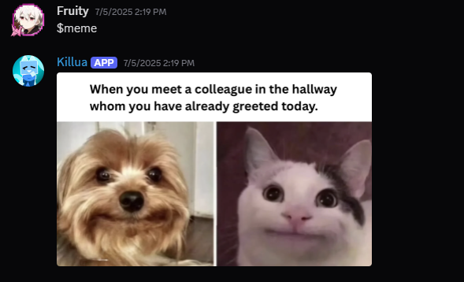
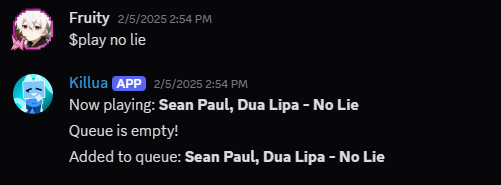
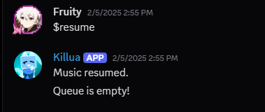
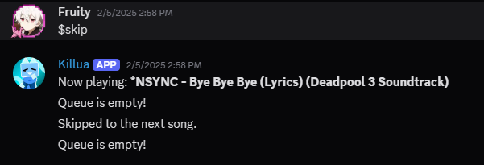

# Killua
Discord Bot that can play music like an actual music bot and can also send memes

## Meme

When you type $meme, Killua will send you a random meme

You type $meme, Killua will send you different memes, here is another example

## Music

When you type $play the song you want to play, the bot will join the call and play the song and it will search on youtube

When there is a song playing and you play another song, the song will added to queue and after the first song finish then only will play the second song

When you type $pause, the bot will pause the song and it will stop playing

When you type $resume, the bot will continue playing the song

When you type $skip, the bot will skip the current song and play the next song that is in queue, if there is no queue then it will just say queue is empty
